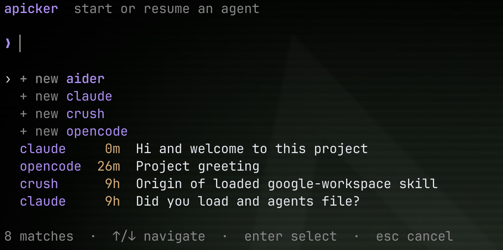

# Agent Picker

A terminal picker to start or resume an agent in the current directory, inspired by [harness-picker](https://github.com/devnull03/harness-picker). Built with Charm's Bubble Tea v2 and Lip Gloss v2



## Install

Requires Go 1.27 or newer to build and at least one of `claude`, `codex`, `pi`, `crush`, `opencode`, or `aider` on your PATH.

```sh
go install ./cmd/apicker
```

For a local checkout, use `just build` to build `./apicker`, or `just install` to build and install it at `~/.local/bin/apicker` (ensure `~/.local/bin` is on your `PATH`). Other recipes: `just fmt`, `just test`, `just vet`, and `just check`. Without `just`, build directly:

```sh
go build -o apicker ./cmd/apicker
```

Run `apicker` from a project directory. Type to filter by agent or session title, use ↑/↓ (or Ctrl-P/Ctrl-N) to navigate, Enter to launch, and Esc to cancel. Backspace removes a character; Ctrl-U clears the search. Only installed agents appear. New chats are listed first, followed by recent chats from this directory. By default, `apicker` exits when the selected agent exits. Run `apicker --loop` to return to a freshly populated picker after each agent session; Esc (or Ctrl-C in the picker) exits the loop. An agent's nonzero exit status is shown and the picker reopens.

Sessions come from `~/.claude/history.jsonl`, `~/.codex/history.jsonl` plus `~/.codex/sessions`, and `~/.pi/agent/sessions`. Crush is queried with `crush session list --json`, and OpenCode with `opencode session list --format json`; OpenCode sessions are filtered by their stored directory. Aider offers one **Continue chat** row when the current directory has a nonempty `.aider.chat.history.md`. New Aider chats start without restoring history; both new and continued chats use that same history file, so Aider does not provide separate selectable threads here. Aider is launched with `--no-auto-commits`.

## Adding an agent

Add `cmd/apicker/harnesses/<agent>.go` in package `harnesses`. Define a type implementing `Harness` (`Name`, `IsAvailable`, `ListSessions`, `NewSession`, and `ResumeSession`) and register it in the same file with `func init() { Register(myAgent{}) }`. Each harness decides how to detect and launch itself; `runInteractive` is available for commands that need terminal stdin, stdout, and stderr. Go compiles all files in the package automatically, so nothing else needs to be added to a central list. Only agents whose `IsAvailable` returns true are shown.
